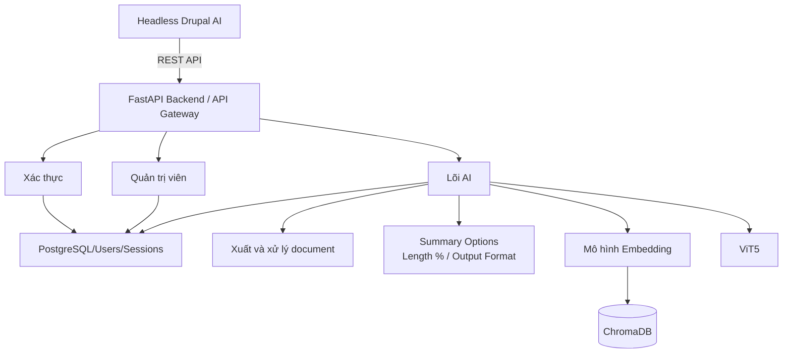
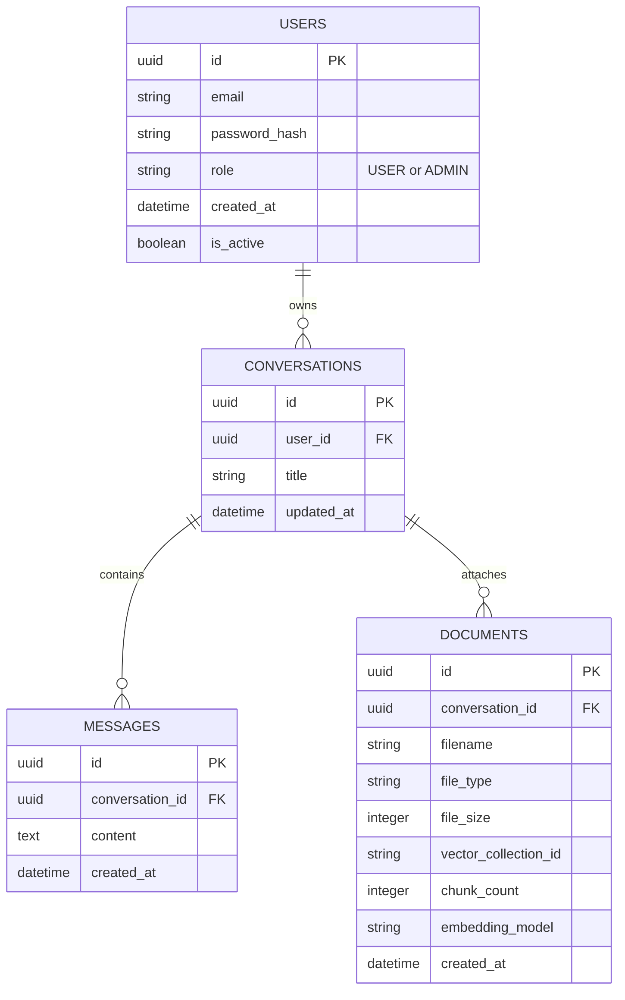
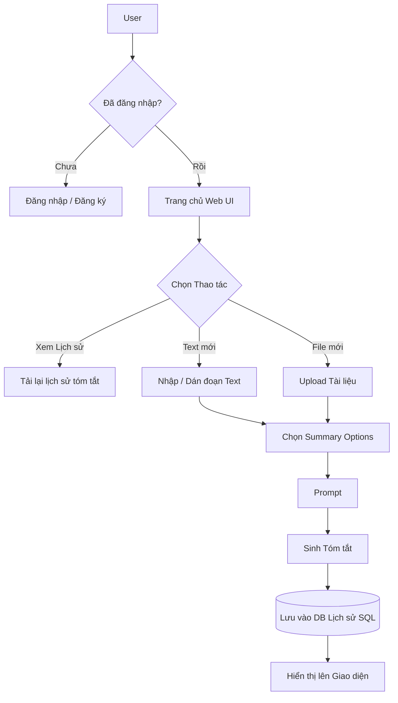
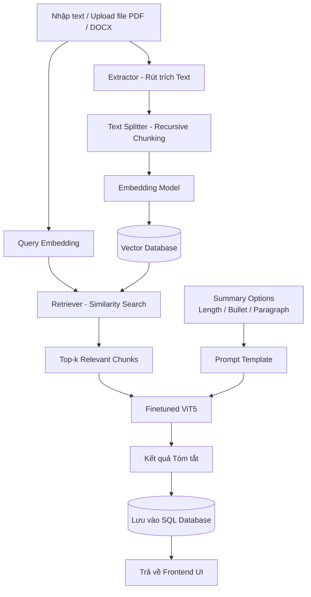
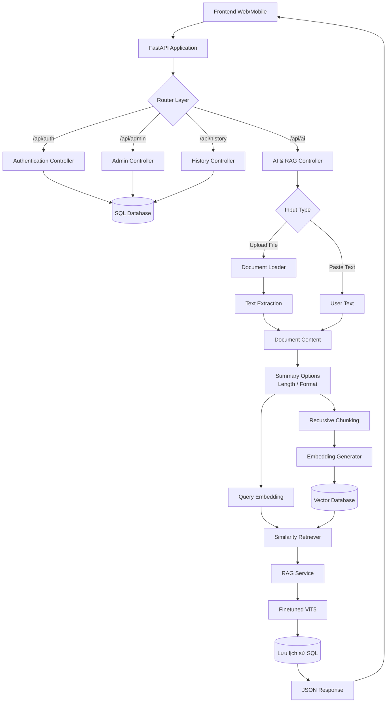
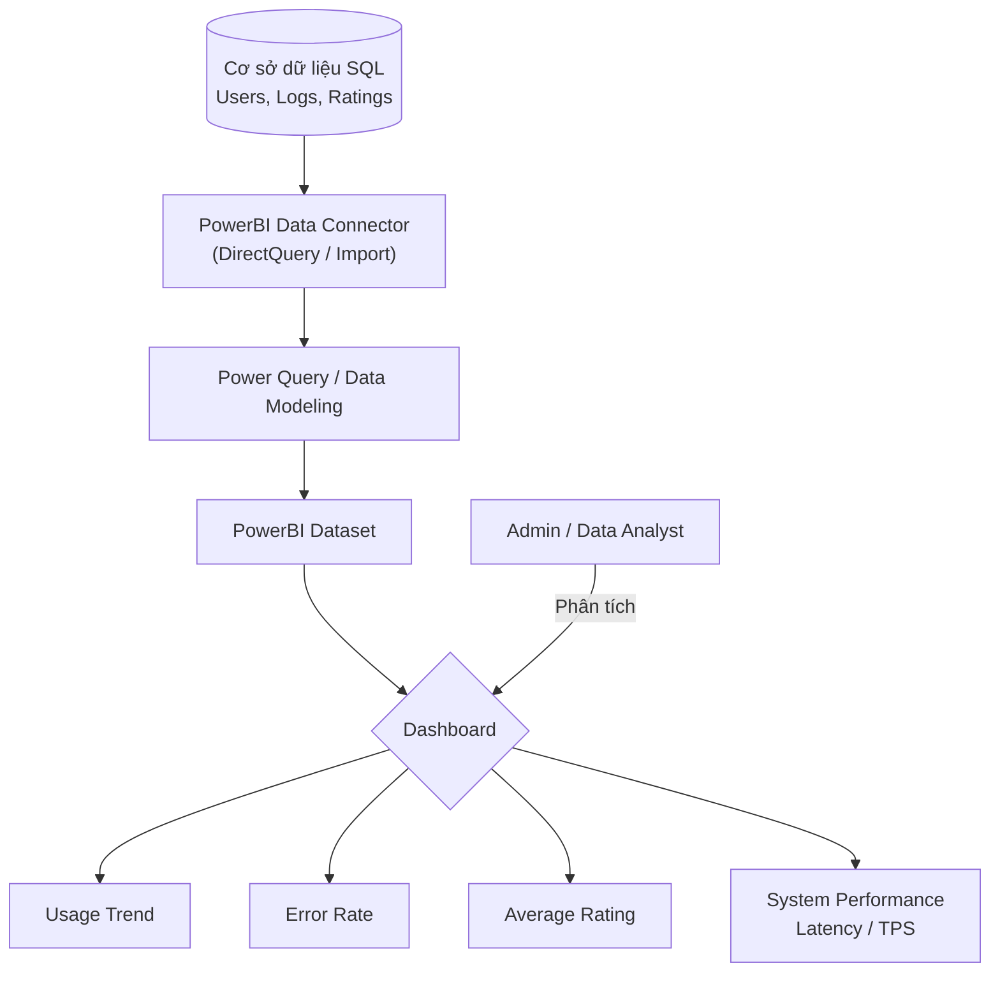

# Tài liệu Kiến trúc Hệ thống

---

## 1️ Sơ đồ Kiến trúc Tổng thể

Mô tả sự giao tiếp tĩnh giữa các cụm thành phần chính. Dữ liệu phi cấu trúc đi vào kho Vector, dữ liệu có trạng thái (Stateful - User, History) đi vào Relational DB.

---

## 2️ Sơ đồ Cơ sở Dữ liệu

Thiết kế CSDL SQL phục vụ lưu trữ lịch sử tóm tắt.

---

## 3️ Luồng Người dùng Cơ bản

Luồng người dùng dành cho hệ thống tóm tắt văn bản.

---

## 4 Pipeline cho RAG

---
## 5 Kiến trúc luồng Backend API

---

## 6 Luồng Phân tích Dữ liệu Hệ thống

Kiến trúc trích xuất dữ liệu và trực quan hóa qua PowerBI.

---
