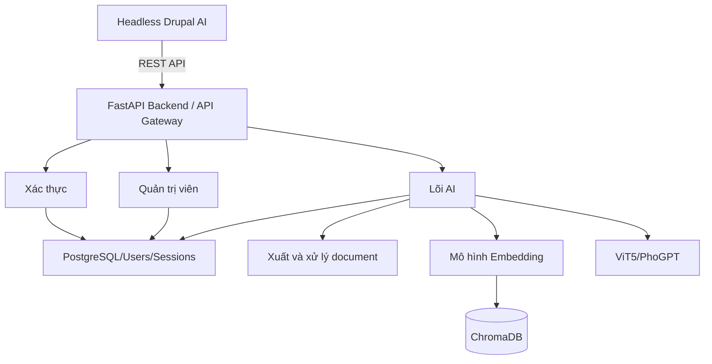
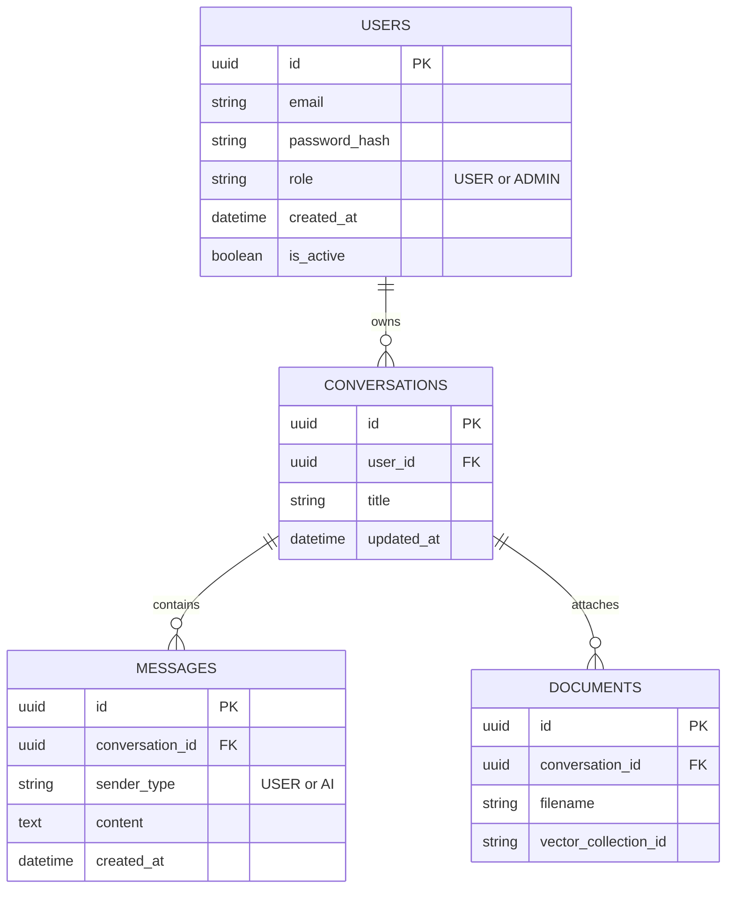
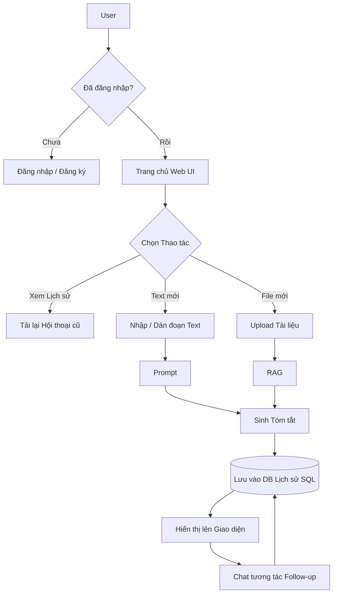
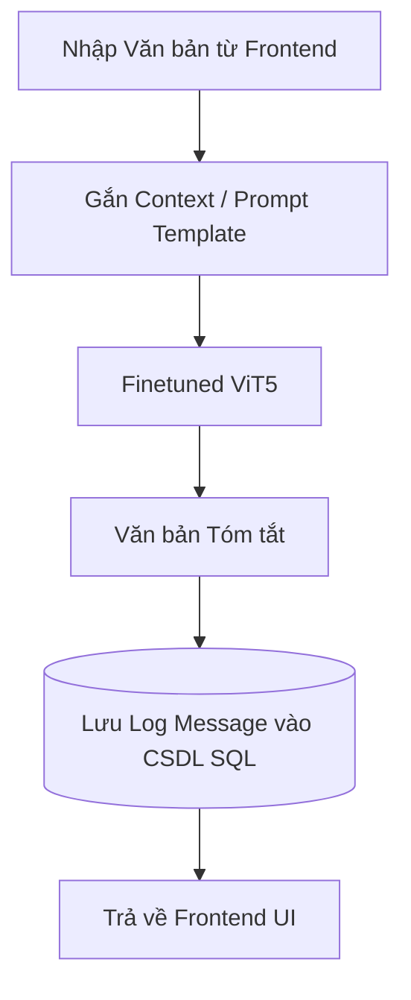
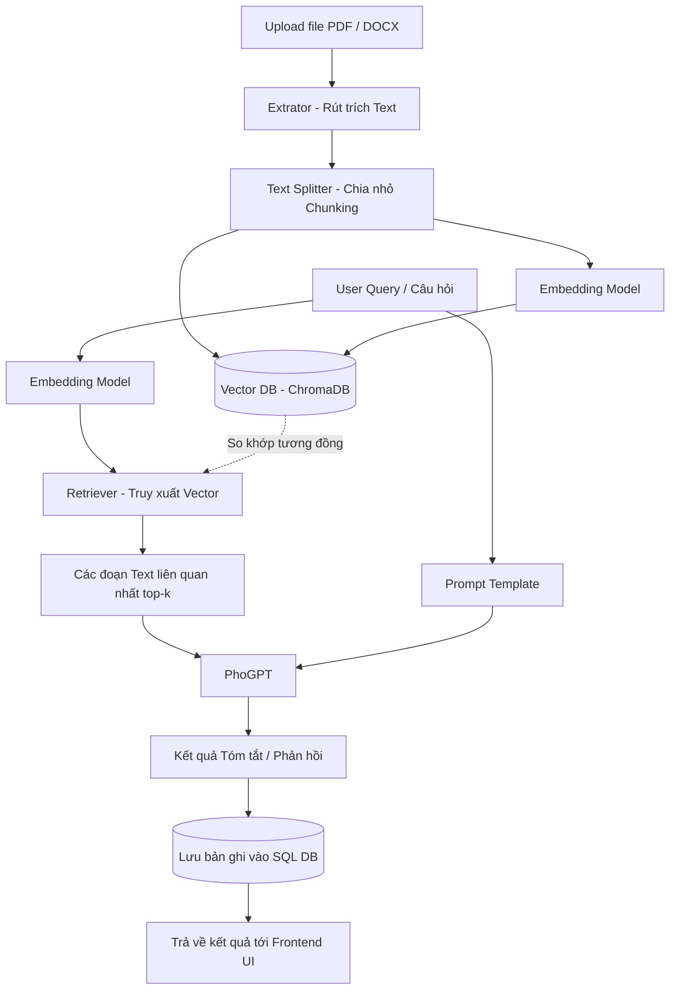
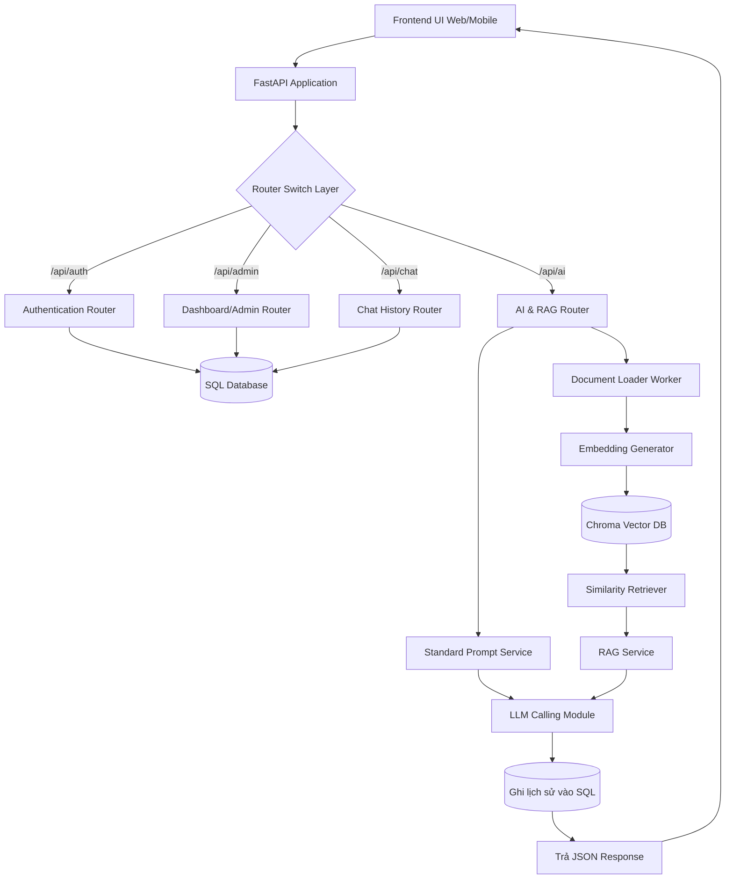
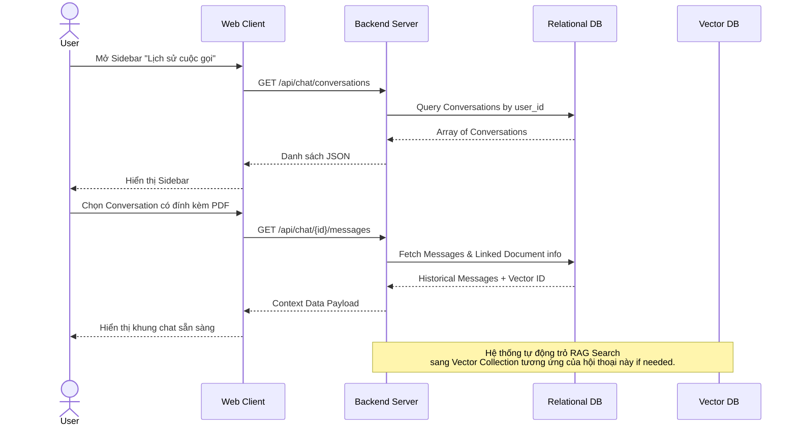
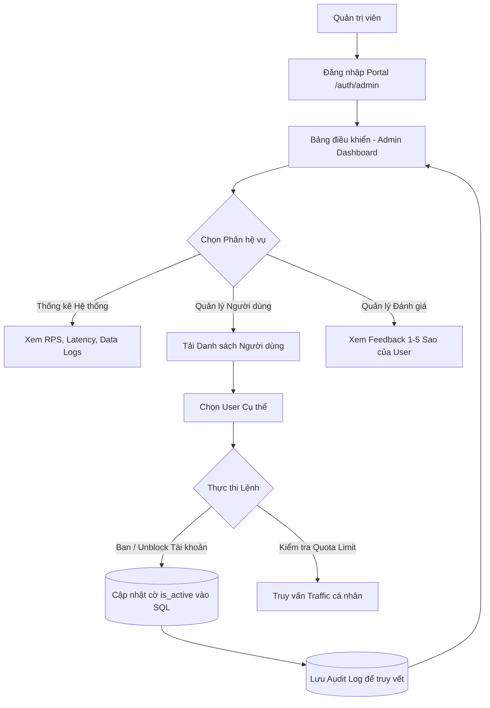
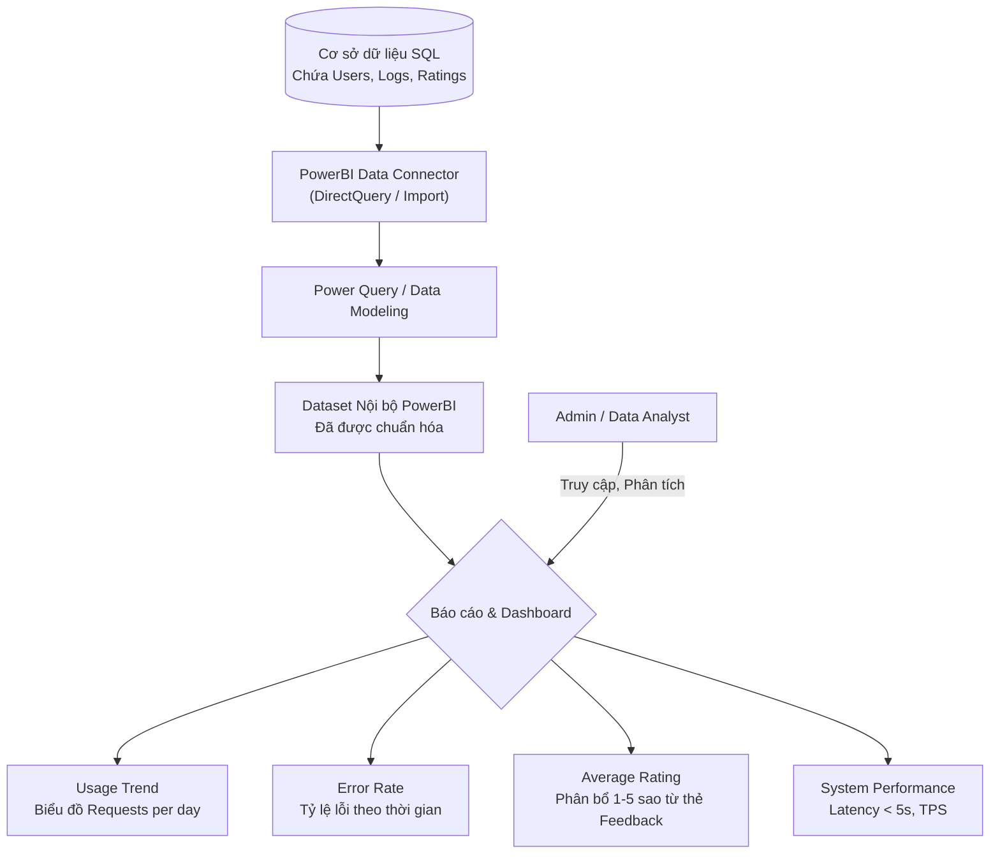

# Tài liệu Kiến trúc Hệ thống

---

  

## 1️ Sơ đồ Kiến trúc Tổng thể

  

Mô tả sự giao tiếp tĩnh giữa các cụm thành phần chính. Dữ liệu phi cấu trúc đi vào kho Vector, dữ liệu có trạng thái (Stateful - User, History) đi vào Relational DB.

  

  

---

  

## 2️ Sơ đồ Cơ sở Dữ liệu

  

Thiết kế CSDL SQL cốt lõi phục vụ tính năng lưu trữ lịch sử phân nhánh, đảm bảo duy trì được luồng hội thoại liên tục cho người dùng.

  

  

---

  

## 3️ Luồng Người dùng Cơ bản

  

Áp dụng thêm luồng kiểm tra uỷ quyền (Authorization). User lấy lại context cũ hoặc tạo mới context thông qua phân loại đầu vào.

  

  

---

  

## 4️ Pipeline cho Prompt Engineering (Document ngắn)

  

Kiến trúc hệ thống dành cho Request nhỏ không cần VectorDB. Tối ưu độ trễ (Latency).

  

  

---

  

## 5️ Pipeline cho RAG (Document dài)

  

Kiến trúc chuẩn cho luồng truy xuất thông tin phân mảnh với RAG (Retrieval-Augmented Generation). Đã tích hợp gắn mã mapping với History DB.

  

  

---

  

## 6️ Kiến trúc luồng Backend API

  

Sơ đồ phân định trách nhiệm các Router và Service của Backend theo chuẩn kiến trúc nguyên khối mô-đun hoá (Modular Monolith).

  

  

---

  

## 7️ Luồng Lưu trữ và Tái tạo Lịch sử Hội thoại (Chat History Flow)

  

Quy trình logic phía dưới UI để tái tạo lại hoàn toàn ngữ cảnh AI như lúc người dùng ngưng chat ở phiên làm việc trước.

  

  

---

  

## 8️ Luồng Quản trị Hệ thống

  

Bộ module dành riêng cho Quyền Admin quản trị người dùng, vận hành và phân tích feedback an toàn, khép kín.

  

---

  

## 9️ Luồng Phân tích Dữ liệu Hệ thống

  

Kiến trúc luồng trích xuất dữ liệu và trực quan hóa (Data Visualization) thông qua PowerBI. Phục vụ việc theo dõi các chỉ số quan trọng như: Usage Trend, Error Rate, Average Rating, và TPS/Latency.

  

